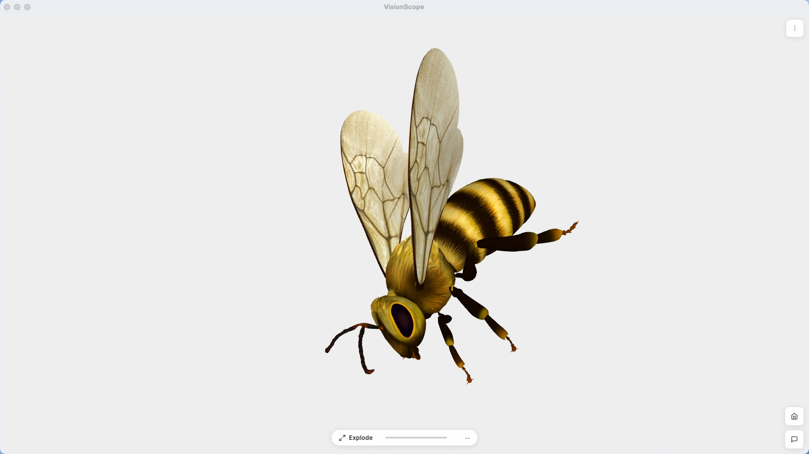

# VisionScope Desktop

[中文](./README.md)

<p align="center">
  
</p>

**Free · Open Source · One App for Every File**

VisionScope is a cross-platform desktop file viewer. Drop a file or double-click to open — images, documents, spreadsheets, 3D models, CAD, point clouds, and more. No need for a dozen apps. One viewer is enough.

> Built with [Tauri](https://tauri.app) — lightweight, fast, and runs locally.

---

## What You Can Do

- Open files by double-click or drag & drop
- Automatic file type detection — no manual picking
- View files locally — nothing gets uploaded
- Completely free and open source

---

## Supported File Types

### Images
`jpg` `jpeg` `png` `webp` `gif` `bmp` `tif` `tiff` `svg`

### 3D Models
`glb` `gltf` `fbx` `obj` `stl` `3ds` `3dm` `3mf` `dae` `ifc` `usdz`, and more

### CAD / Engineering
`dwg` `dxf` `step` `stp` `iges` `igs` `brep`

### Point Clouds
`pcd` `ply` `las` `laz`

### Textures
`ktx2` `basis`

### Documents
`pdf` `doc` `pptx` `ppt` `txt` `md`

### Spreadsheets
`csv` `tsv` `xlsx` `xls` `ods`

### Audio & Video
`mp4` `webm` `avi` `mov` `mkv` `mp3` `wav` `flac` `aac` `ogg`

### Code & Text
`js` `ts` `py` `java` `go` `rs` `c` `cpp` `html` `css` `json` `yaml` `xml` `sql` `sh`, and more

### Archives
`zip` `rar` `7z` `tar` `gz` (preview files inside)

---

## Development

```bash
pnpm install
pnpm tauri dev
```

Build:

```bash
pnpm tauri build
```

---

## License

MIT License — free to use, modify, and distribute.
